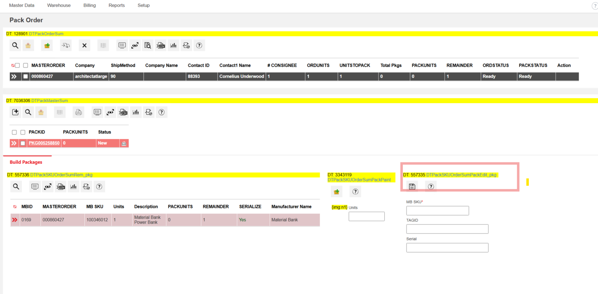
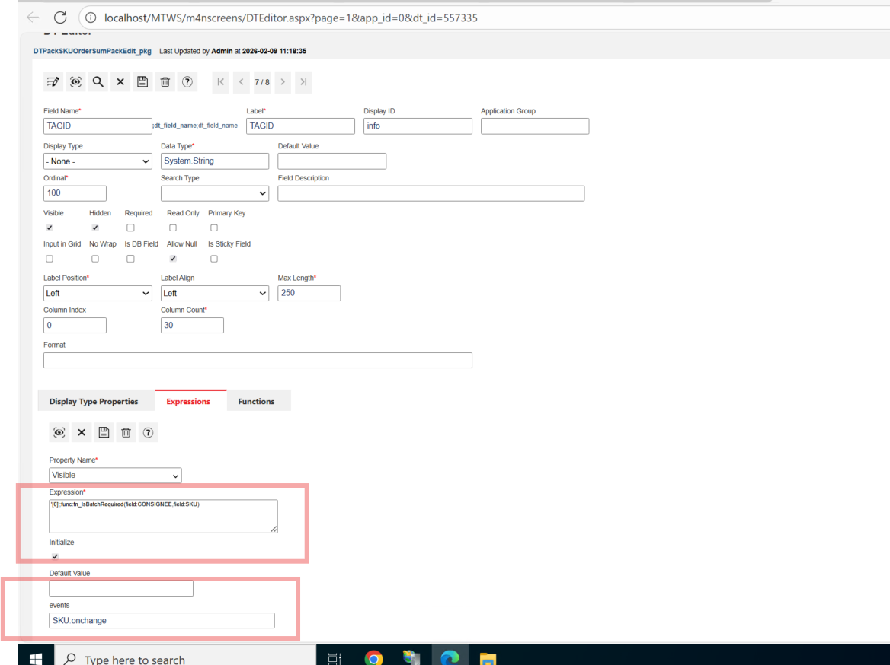
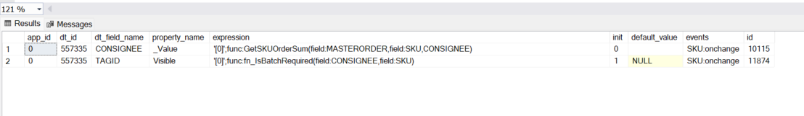
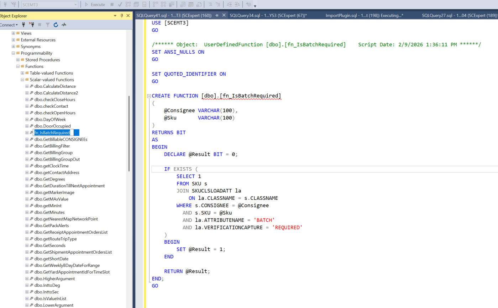
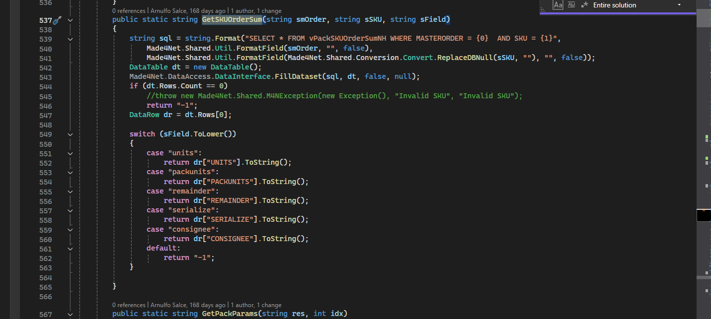
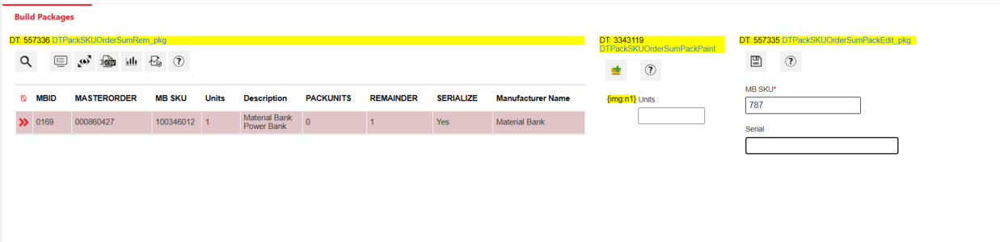

#Field Expressions

## Dynamic Field Visibility Using DT Expressions

## Overview

This document explains **end-to-end how a field visibility is controlled dynamically** using an example from MT client **Pack Order** screen using:

- DT field expressions
- onchange Event
- Framework-level functions
- Database-level functions

The goal is to clearly document **why TAGID appears or disappears when SKU changes**, and how the full execution flow works.

---

## Scope

This document covers:

- DT configuration and expressions
- Event triggering (`SKU:onchange`)
- Framework function execution
- SQL function execution
- UI behavior and outcomes

---

## Data Table Information

| Property | Value |
|--------|------|
| DT ID | 557335 |
| DT Name | DTPackSKUOrderSumPackEdit_pkg |
| Screen | Pack Order → Build Packages |
| Panel | Right-side Pack Edit |
| Primary Trigger | SKU change |

**Pack Order Screen**  


---


### TAGID

Field expression is given to Tag id under expressions tab and it is binded to onchange event of sku.
So what ever function we give in this expressions gets executed when sku is changed 
Onchange event includes changing sku value, shifting keyboard control from sku field to anyother field.

- Display Type: Info
- Data Type: String
- Shown or hidden dynamically
- Visibility controlled entirely by DT expression

 **TAGID Field**  


---

## DT Expression Configuration

### Field: TAGID

**Property Controlled**
```
Visible
```

**Expression**
```
'0';func:fn_IsBatchRequired(field:CONSIGNEE,field:SKU)
```

**Event**
```
SKU:onchange
```

This configuration means **every time SKU changes**, the visibility of TAGID is recalculated.
On sku Change a sql function fn_IsBatchRequired gets called

**TAGID Expression Configuration**  



## SQL Function: fn_IsBatchRequired

### Purpose

Determines whether ** tag id** should be visible or not.

### Function Signature

```sql
fn_IsBatchRequired (
    @Consignee VARCHAR(100),
    @Sku VARCHAR(100)
) RETURNS BIT
```

### Logic Summary

- Default result = `0` 
- Checks SKU class attributes
- If `BATCH` attribute exists with `VERIFICATIONCAPTURE = 'REQUIRED'`
  - Returns `1`
- Otherwise
  - Returns `0`

function returning 0 means, TagId visibility = false ( TagID not visible)
function returning 1 means, TagId visibility = True ( TagID visible)

**fn_IsBatchRequired Function**  



---

## Event Lifecycle

### SKU:onchange

The `SKU:onchange` event is fired when:

- A SKU is selected
- A SKU value is typed
- A SKU value is replaced

This event triggers **immediate re-evaluation** of all DT expressions bound to it.

** Event Configuration**  


---

## App Logic Function: GetSKUOrderSum

### Purpose

`GetSKUOrderSum` retrieves summary data for a given **MASTERORDER + SKU** combination.

- Written in App.Logic
- Executed when sku onchange happens.

### Data Source

```sql
vPackSKUOrderSumNH
```

### Possible returned values

| Field Parameter | Returned Value |
|---------------|----------------|
| units | UNITS |
| packunits | PACKUNITS |
| remainder | REMAINDER |
| serialize | SERIALIZE |
| consignee | CONSIGNEE |

**GetSKUOrderSum Code**  


##Parameter Handling in GetSKUOrderSum

In the DT expression configuration, the function is called like this:

```
func:GetSKUOrderSum(field:MASTERORDER,field:SKU,CONSIGNEE)
```


In DT expressions:

```
field:FIELDNAME
```

means:

> Pass the current value of this UI field to the function.

So in this case:

- `field:MASTERORDER` → passes the current MASTERORDER value from the UI row  
- `field:SKU` → passes the current SKU value from the UI row  

These values are dynamic and come from the Data Table.

---

###  `CONSIGNEE` is passed as string literal

The third parameter:

```
CONSIGNEE
```

is **not a UI field reference**.

It is a literal string value passed to the function.

Inside the function in App Logic:

```csharp
public static string GetSKUOrderSum(string smOrder, string sSKU, string sField)
```

The third parameter (`sField`) tells the function **which column to return** from the query result.

Inside the switch statement:

```csharp
case "consignee":
    return dr["CONSIGNEE"].ToString();
```

So:

- `CONSIGNEE` is acting as a selector  
- It tells the function which column to extract from `vPackSKUOrderSumNH`  
- It is not reading the UI field value  

---

### Function Call

```
GetSKUOrderSum(
    field:MASTERORDER,   ← value from UI
    field:SKU,           ← value from UI
    CONSIGNEE            ← literal string telling function which DB column to return
)
```
The third parameter dynamically decides which column is returned.

---


## End-to-End Execution Flow

```
User changes SKU
      ↓
SKU:onchange event fired
      ↓
GetSKUOrderSum called (App.Logic)
      ↓
CONSIGNEE resolved
      ↓
fn_IsBatchRequired called (SQL function)
      ↓
Function returns 1 or 0
      ↓
TAGID Visible or Hidden
```


---

## UI Behavior

### Why TAGID Disappears on SKU Change

- TAGID visibility is bound to `SKU:onchange`
- When SKU is edited or partially entered:
  - SKU may be temporarily invalid
  - No matching SKU data found
- `fn_IsBatchRequired` returns `0`
- TAGID is hidden immediately


** TAGID Hidden After SKU Change**  


---
