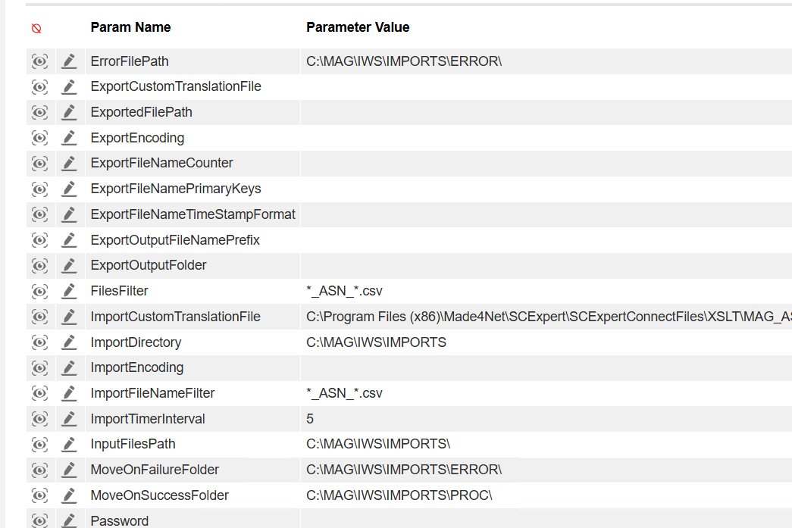

# Troubleshooting File Imports

## Inconsistent file movement to destination folder

Things to check when an Error word keeps appending to the file instead of moving to either Success or Error folder

Check Plugin Params for Folder Directory
make sure folder directory exists and ends with a back slash '\'

## Import Deosn't happen when a file is dropped

Make sure the services are on

Make sure you are dropping in the correct import Directory
 
Make sure the file filter you are using is correct. It should match from the plugin params.

If it doesn't get fixed after checking the above points, then check validations in code for the file exentions.

**Ignore case for the file extention using either**

**oInputFile.Extension.ToUpper() == ".JSON"**

or

**String.Equals(oInputFile.Extension, ".JSON", StringComparison.OrdinalIgnoreCase);**