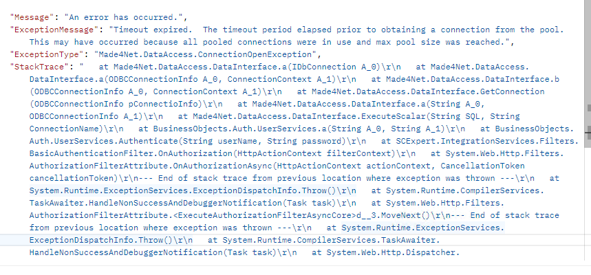

# CSV File import from Workstation screen

## Server disconnection

Took GEM client as reference for documenting
You can find all the imports from workstation changes at this m4nxfer folder

```
C:\M4NXFER\2024\ScreensImportFileButtonSetup
```

To add an import button on workstation screen use util function AddImportButton()
Call this function where needed
```
Utils.AddImportButton(TEMasterInboundOrders, WMS.Lib.BOTypes.C_INBOUND)
```

Also add the following nodes to  SKinConfig.xml for import icons

```
		<Image Name="ActionBarSAASImport" Src="ActionBar/ActionBarSAASImport.png" />
		<Image Name="ActionBarSAASExport" Src="ActionBar/ActionBarSAASExport.png" />
```


Custom DTs are prepared for the import screens


**Timeout error on Postman**  



## Sequence of execution

on calling AddImportButton() method, it opens a pop up screen


AddImportButton() logic dynamically adds an import button to the tableEditor
It brings the import icon image from skin configuration,  and injects javascript into the page.
This JS opens a telerik RadWindow popup pointing to the DT which we send to importer.aspx :
```
../m4nScreens/importer.aspx?ImprtObj={BOname}
```

In the page load of importer 

after selecting csv file, on clicking import button it calls importer.aspx sending BOname as query params.
In the page load of Importer, we capture the BOname from the query params and use it setting DefaultDt on the telerik popup page

Code to Capture Query param and set it to default DT

```
  Private Sub Page_Load(ByVal sender As System.Object, ByVal e As System.EventArgs) Handles MyBase.Load
      Session("ImprtObj") = Request.QueryString("ImprtObj").ToLower()
      divSummery.Visible = False
      If Not IsPostBack Then
	  //Here defaultDT is assigned from query params
          TEImporter.DefaultDT = String.Format("DTvObjectsImport{0}", Request.QueryString("ImprtObj"))
          TEImporter.Restart()
          divSummery.Visible = False
      End If
  End Sub
```

---

