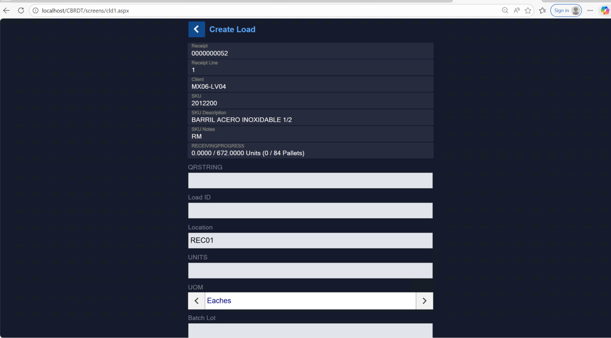
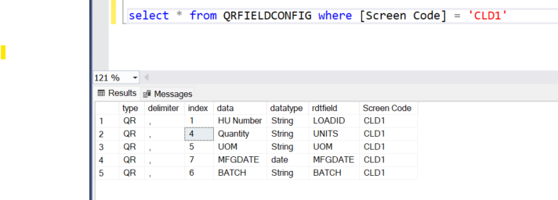

# QRString Configuration – Create Load (CLD1)

## Overview

On the **Create Load (CLD1)** RDT screen, a new field **QRString** was added.

The purpose of this field is to allow users to scan or manually enter a comma-delimited string that contains multiple field values in a single input.

These values are dynamically mapped to screen fields based on configuration in the **QRFIELDCONFIG** table in the App database.


**CLD1 Screen**  



**QRFieldConfig Table**  


---

## Screen: Create Load (CLD1)

QRString is entered by the user before processing.

Example screen fields that can be populated via QRString for Create Load Screen:

- Load ID  
- Units  
- UOM  
- MFG Date  
- Batch  

---

## Database Configuration – QRFIELDCONFIG

QR parsing behavior is fully driven by the **QRFIELDCONFIG** table.

Example query:

```sql
select * from QRFIELDCONFIG where [Screen Code] = 'CLD1'
```

### Example Configuration

| index | rdtfield | datatype |
|-------|----------|----------|
| 1     | LOADID   | String   |
| 4     | UNITS    | String   |
| 5     | UOM      | String   |
| 7     | MFGDATE  | date     |
| 6     | BATCH    | String   |

The `index` column determines which position in the QR string maps to which screen field.

---

## QRString Format

### Full QR Example

```
100001,10,EA,20260220,BAT101
```

Maps to:

| Field   | Value     |
|----------|----------|
| LoadId  | 100001   |
| Units   | 10       |
| UOM     | EA       |
| MFGDATE | 20260220 |
| Batch   | BAT101   |

---

### Partial QR Example

```
100001,10,EA,,
```

User may leave values empty using delimiters.

Empty values are still processed based on index position. We can Add required validations in the code if necessary.

---

## Code Integration – CLD1.aspx.vb

In `CLD1.aspx.vb`, inside `doNext()`:

```vb
MobileUtils.ParseQRStringToFields(DO1, DO1.Value("QRSTRING"), "CLD1")
DO1.Value("QRSTRING") = ""
MobileUtils.PopulateQRFields(DO1)
```

### Execution Flow

1. Parse QRString
2. Clear QRSTRING field
3. Repopulate fields from session storage

---

# MobileUtils Implementation

## Parse Function

```vb
Public Shared Sub ParseQRStringToFields(ByRef pDO As Made4Net.Mobile.WebCtrls.DataObject, qrstring As String, screenCode As String)
```

### What This Function Does

1. Validates QR string
2. Reads QRFIELDCONFIG for the screen
3. Splits QR string using configured delimiter
4. Maps values by index
5. Converts dates (if datatype = date)
6. Assigns values to DataObject (DO1)
7. Stores parsed values in Session dictionary

---

### Date Conversion Logic

If datatype = `date` and value length = 8:

Input format:
```
ddMMyyyy
```

Converted to:
```
MM/dd/yyyy
```

Example:

```
20260220 → 02/20/2026
```

---

### Session Storage

Parsed values are stored in session:

```vb
HttpContext.Current.Session("QRParsedFields")
```

Stored as:

```vb
Dictionary(Of String, String)
```

Example:

```
{
  "LOADID" : "100001",
  "UNITS"  : "10",
  "UOM"    : "EA"
}
```

---

## Populate Function

```vb
Public Shared Sub PopulateQRFields(ByRef pDO As Made4Net.Mobile.WebCtrls.DataObject)
```

### What It Does

1. Reads session dictionary
2. Assigns values back to DO1
3. Clears session after use

```vb
HttpContext.Current.Session.Remove("QRParsedFields")
```

---

# End-to-End Flow

1. User enters/scans QRString
2. System reads QRFIELDCONFIG
3. Values split by delimiter
4. Values mapped using index
5. Date conversion applied if needed
6. Fields assigned to DO1
7. Values stored in session
8. values auto-populated to Do1 object
9. Session cleared

---

# Summary

The QRString implementation allows flexible, configuration-driven field population on mobile screens using a single scanned input.

All mapping logic is controlled from the QRFIELDCONFIG table, making it reusable across multiple mobile screens.