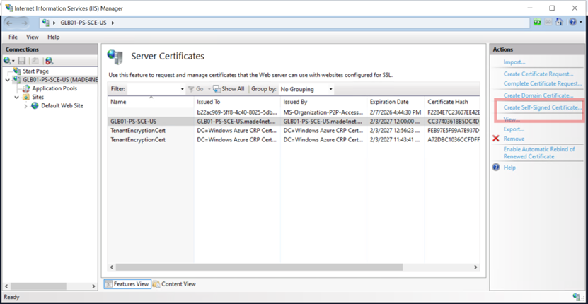
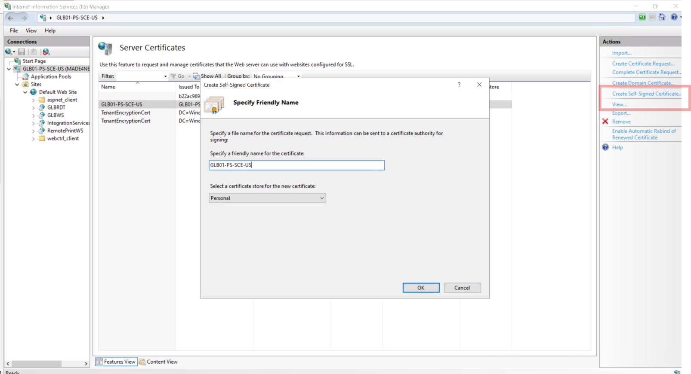
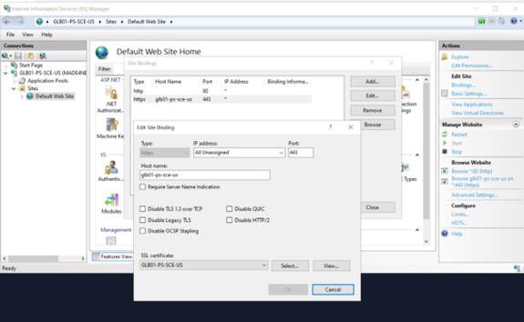
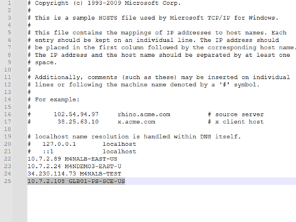
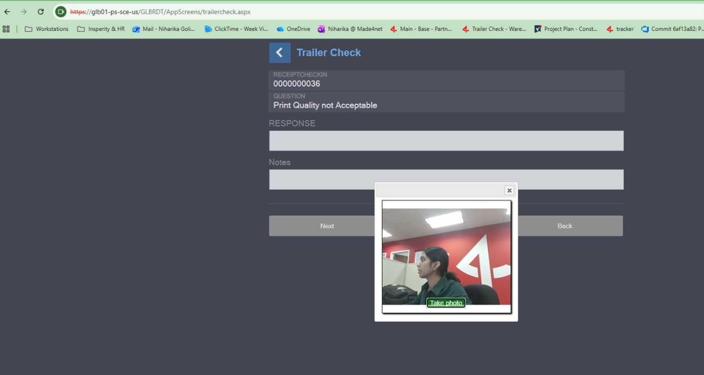

# SSL Certificate Setup for IIS (HTTPS Enablement for RDT / Web Apps)

## Overview

The **SSL Certificate Setup** enables HTTPS access for IIS-hosted web applications running on **Azure servers**.

This setup is required for features such as **camera access**, which are blocked by browsers on servers when applications are accessed over non-secure (HTTP) connections.


---

## Purpose

- Enable HTTPS for IIS-hosted applications
- Allow browser features such as **camera access**
- Support secure access from local machines to server-hosted applications
- Standardize HTTPS configuration across environments

---

## Scope

- IIS SSL certificate creation and binding
- Local host file updates 
- Web.config security header updates
- Validation of HTTPS and camera access

---

## Implementation Summary

While performing application workflows that require browser features such as **camera access**, users were unable to proceed when accessing the application over HTTP.

To resolve this:
- A **self-signed SSL certificate** was created on the IIS server
- HTTPS binding was configured at the IIS site level
- Local hostname mapping was added
- Required security policies and camera permissions should be updated in `Web.config`

This allows secure HTTPS access and enables browser-restricted features.

---

## Affected Components

| Component | Details |
|---|---|
| IIS | SSL certificate and HTTPS binding |
| Web.config | Security headers |
| Environment | DEV |
| Server | Azure VM |

---

## IIS Configuration

### Create Self-Signed Certificate

On the **application server**:

1. Open **IIS Manager**
2. Select the **server node**
3. Open **Server Certificates**
4. Click **Create Self-Signed Certificate**
5. Enter a certificate name matching the server hostname

**Creating Self-Signed Certificate** 


**Match Certificate name with Server Name**



---

### Bind Certificate to IIS Site

1. Navigate to:
   ```
   Sites → Default Web Site
   ```
2. Click **Bindings** (right panel)
3. Click **Add**

Configure:

| Setting | Value |
|---|---|
| Type | https |
| IP Address | All Unassigned |
| Port | 443 |
| Host name | Server name |
| SSL Certificate | Select the self signed certificate you created |

**Binding Certificate to IIS**  



Save the binding.

---

## Web.config Updates

Update the application’s (Workstation or RDT) `Web.config` to allow camera access and related browser features.

### Content-Security-Policy

```xml
<add name="Content-Security-Policy"
     value="default-src * 'unsafe-inline' 'unsafe-eval';
            script-src * 'unsafe-inline' 'unsafe-eval';
            connect-src * 'unsafe-inline';
            img-src * data: blob: 'unsafe-inline';
            frame-src *;
            style-src * 'unsafe-inline' 'unsafe-eval';
            style-src-elem * 'unsafe-inline' 'unsafe-eval'" />
```


---

### Permissions-Policy

```xml
<add name="Permissions-Policy"
     value="accelerometer=(), geolocation=(), gyroscope=(),
            magnetometer=(), microphone=(), payment=(), usb=()" />
```


---

## Local Machine Configuration (DEV Testing)

### Update Hosts File

On the local machine, edit the hosts file as **Administrator**:

```
C:\Windows\System32\drivers\etc\hosts
```

Add:

```
<ServerIP>   <server-host-name>
```

**Update Host file in drivers folder on local machine**  



---

## Validation / Testing

From the local machine, access the application using HTTPS:

```
https://<server-host-name>/<application-path>
```

**Output**  



### Expected Results

- HTTPS connection established
- Browser prompts for **camera permission**
- Camera access works successfully


---

## Integration Impact

- No database changes
- No scheduler or backend logic changes
- Changes limited to IIS, Web.config, and local access configuration

---


This setup provides a secure and reusable approach for enabling HTTPS across client environments.
