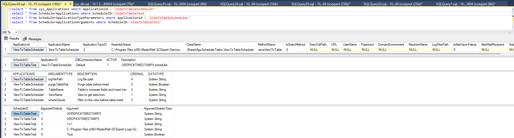

# ViewToTable Scheduler

## Overview

The **ViewToTable Scheduler** is a reusable, configuration-driven scheduler that copies data from a **SQL View** into a **SQL Table**.

This scheduler requires **no new code** for each use case.  
All behavior is controlled through **database configuration only**.

The same scheduler implementation can be reused across multiple environments and requirements.

---

## Purpose

- Move data from **View → Table**
- Avoid writing custom scheduler code
- Provide a standardized and reusable solution
- Reduce maintenance overhead
- Enable quick onboarding for new use cases

---

## Flow

1. Scheduler is triggered
2. Scheduler reads configuration from Scheduler tables
3. Data is selected from the configured SQL View
4. Matching columns are inserted into the configured SQL Table
5. Execution details are written to scheduler logs

---

## Scheduler Implementation Details

| Item | Value |
|----|----|
| DLL | `SharedAppSchedulerTasks.dll` |
| Class | `SharedAppSchedulerTasks.ViewToTableScheduler` |
| Method | `saveViewToTable` |

---

## How the Scheduler Works

The scheduler performs the following actions internally:

1. Reads the **View name** and **Table name** from arguments
2. Reads the column list from the target table
3. Builds a dynamic SQL statement:

   
```sql
   INSERT INTO <Table>(<Matching Columns>)
   SELECT <Matching Columns>
   FROM <View>
   WHERE <Where Clause>
```

---

## Configuration Setup


[](../img/viewtotable.png)

### sys_Applications

This is **configuration** will be created **once per environment**.

Registers the shared scheduler implementation in the system.
Tells SCExpert which DLL, class, and method to execute.

```sql
INSERT INTO sys_Applications
VALUES
(
  'ViewToTableScheduler',
  'ViewToTableScheduler',
  2,
  'C:\Program Files (x86)\Made4Net\SCExpert\Services\SharedAppSchedulerTasks.dll',
  'SharedAppSchedulerTasks.ViewToTableScheduler',
  'saveViewToTable',
  0,
  NULL,NULL,NULL,NULL,NULL,NULL,NULL,
  0,
  NULL,NULL
);
```

> ⚠️ Do **NOT** recreate this entry for every scheduler.
> All ViewToTable scheduler instances reuse this configuration.


### SchedulerApplications

Creates a scheduler instance that binds a schedule ID to the
`ViewToTableScheduler` application.


```sql
insert into SchedulerApplications values ('ViewToTableTest','ViewToTableScheduler','Default',1,'ORDPICKTIMESTAMPS scheduler')
```


### SchedulerApplicationArguments

Defines runtime arguments passed to the scheduler. These values control which view is read, which table is written, and how the data is processed.

```sql
INSERT INTO SchedulerApplicationArguments
(
    ScheduleID,
    ArgumentOrdinal,
    Argument,
    ArgumentSystemType
)
VALUES
    ('ViewToTableTest', 1, 'VORDPICKTIMESTAMPS', 'System.String'),
    ('ViewToTableTest', 2, 'ORDPICKTIMESTAMPS',  'System.String'),
    ('ViewToTableTest', 3, '1=1',                'System.String'),
    ('ViewToTableTest', 4, 'C:\Program Files (x86)\Made4Net\SCExpert\Logs\Scheduler\', 'System.String'),
    ('ViewToTableTest', 5, 'True',               'System.Boolean');
```

### SchedulerApplicationTypeParameters

Defines the expected arguments, their order, data type, and meaning for the ViewToTableScheduler.
This configuration allows the scheduler to: Validate arguments, Display metadata correctly, Maintain a consistent argument contract across environments

```sql
INSERT INTO SchedulerApplicationTypeParameters
    (APPLICATIONID, ARGUMENTTYPE, DESCRIPTION, ORDINAL, DATATYPE)
VALUES
    ('ViewToTableScheduler', 'ViewName',
     'View to get data from',                   1, 'System.String'),

    ('ViewToTableScheduler', 'TableName',
     'Table to compare fields and insert into', 2, 'System.String'),

    ('ViewToTableScheduler', 'whereClause',
     'Filter on the view before table insert',  3, 'System.String'),

    ('ViewToTableScheduler', 'logFilePath',
     'Log file path',                           4, 'System.String'),

    ('ViewToTableScheduler', 'purgeTableFirst',
     'Purge table before insert',               5, 'System.Boolean');
```

### Note

**VORDPICKTIMESTAMPS** and **ORDPICKTIMESTAMPS** are used as an example in this document.  
New views and tables can be supported by creating a new ScheduleID and configuring scheduler arguments, without writing any new code.


