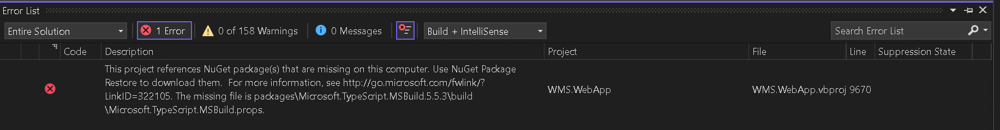

# Build Error: NuGet Reference


## Overview

Some older solutions fail to build with a NuGet error like:

> This project references NuGet package(s) that are missing on this computer…  
> The missing file is `packages\Microsoft.TypeScript.MSBuild.x.x.x\build\Microsoft.TypeScript.MSBuild.props`

Even after running **NuGet Restore**, the build may still fail if the project file has **duplicate references** to different versions of the same package.

This issue is commonly seen with:

- `Microsoft.TypeScript.MSBuild`


---

## Purpose

- Fix build failures caused by missing `Microsoft.TypeScript.MSBuild.props/targets`
- Resolve **duplicate TypeScript MSBuild references** in `.vbproj`
- Standardize the project to use **one TypeScript MSBuild version** and **one package path**

---

## Symptoms

You may see the following:

[](../img/nuget.png)

---

## Root Cause

The project file (`.vbproj` / `.csproj`) contains **multiple** `Microsoft.TypeScript.MSBuild` references, often with:

- different versions (ex: `5.5.3` + `5.7.1`)
- different package locations (ex: `packages\...` + `..\packages\...`)

MSBuild validates **all listed versions**.  
Even if one version is installed, the build fails if another referenced version is missing.

---

## Fix Flow

1. Identify which TypeScript MSBuild version is actually installed
2. Edit the project file and remove the **duplicate / old version checks**
3. Keep only **one** version + **one** path
4. Clean, Restore, and Rebuild

---

## Step-by-Step Fix

## Step 1 — Check which package version exists

Look in your repo:

- `.\packages\Microsoft.TypeScript.MSBuild.*`
- `..\packages\Microsoft.TypeScript.MSBuild.*`

Use the version that actually exists.

---

## Step 2 — Edit the project file

Open the failing project file (example: `WMS.WebApp.vbproj`) and search for:

- `EnsureNuGetPackageBuildImports`
- `Microsoft.TypeScript.MSBuild`

You may see something like this:


```
<Target Name="EnsureNuGetPackageBuildImports" BeforeTargets="PrepareForBuild">
  <Error Condition="!Exists('packages\Microsoft.TypeScript.MSBuild.5.5.3\build\Microsoft.TypeScript.MSBuild.props')" Text="..." />
  <Error Condition="!Exists('packages\Microsoft.TypeScript.MSBuild.5.5.3\build\Microsoft.TypeScript.MSBuild.targets')" Text="..." />

  <Error Condition="!Exists('..\packages\Microsoft.TypeScript.MSBuild.5.7.1\build\Microsoft.TypeScript.MSBuild.props')" Text="..." />
  <Error Condition="!Exists('..\packages\Microsoft.TypeScript.MSBuild.5.7.1\build\Microsoft.TypeScript.MSBuild.targets')" Text="..." />
</Target>

<Import Project="packages\Microsoft.TypeScript.MSBuild.5.5.3\build\Microsoft.TypeScript.MSBuild.targets"
        Condition="Exists('packages\Microsoft.TypeScript.MSBuild.5.5.3\build\Microsoft.TypeScript.MSBuild.targets')" />

<Import Project="..\packages\Microsoft.TypeScript.MSBuild.5.7.1\build\Microsoft.TypeScript.MSBuild.targets"
        Condition="Exists('..\packages\Microsoft.TypeScript.MSBuild.5.7.1\build\Microsoft.TypeScript.MSBuild.targets')" />
```


✅ Keep only the version that exists in your repo  
❌ Remove the `Error` and `Import` lines for the missing or older version

**Example:**  
If `Microsoft.TypeScript.MSBuild 5.7.1` is installed, remove all references to `5.5.3`.

---

## Step 3 — Clean and Rebuild

1. Close Visual Studio
2. Delete the following folders:
   - `.vs`
   - `bin`
   - `obj`
3. Restore NuGet packages
4. Rebuild the solution

After removing duplicate TypeScript MSBuild references, the solution builds successfully without Errors.

---

## Notes

- Do **not** keep multiple versions of `Microsoft.TypeScript.MSBuild` in the same project file
- Always align the project file with the version restored by NuGet

